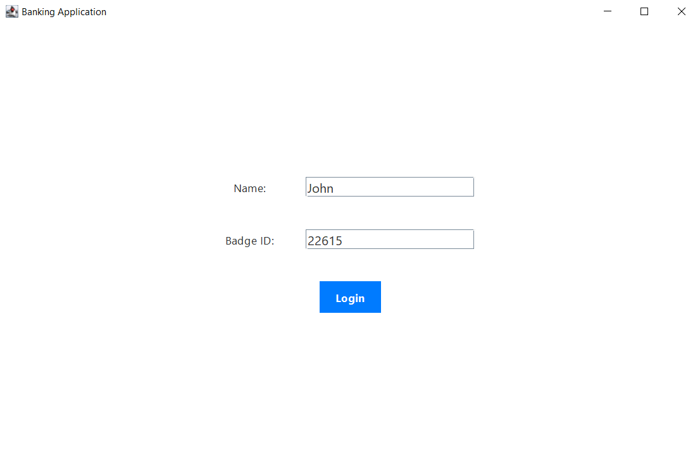
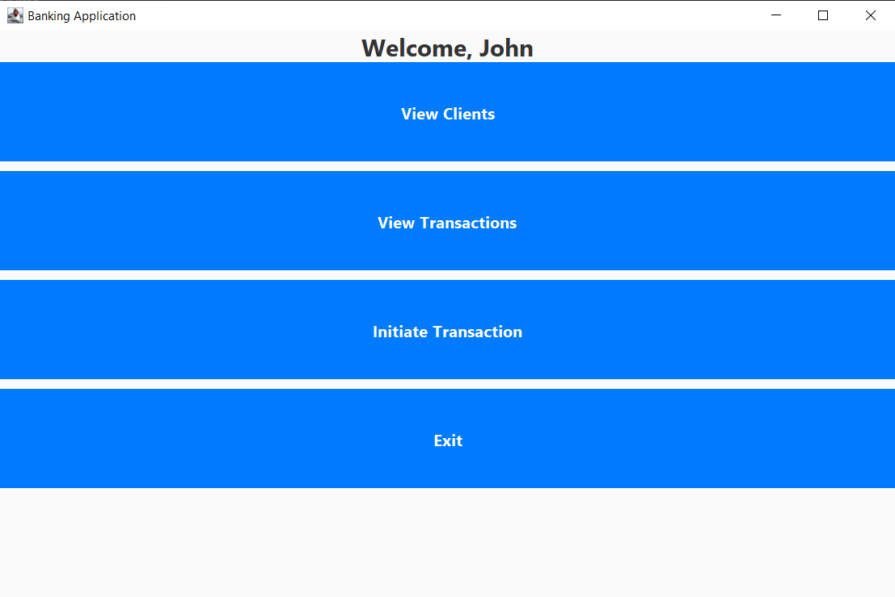
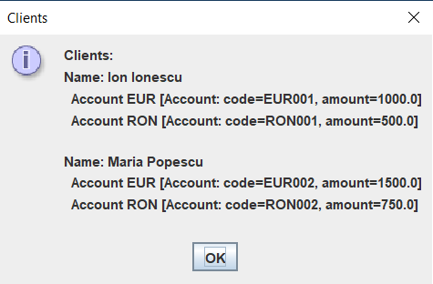
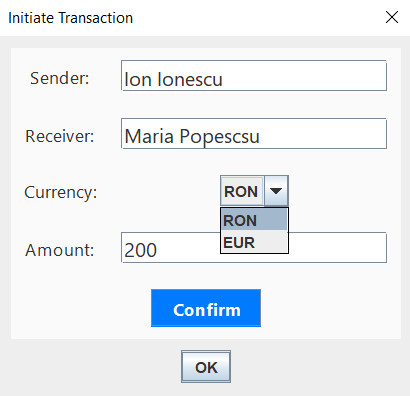
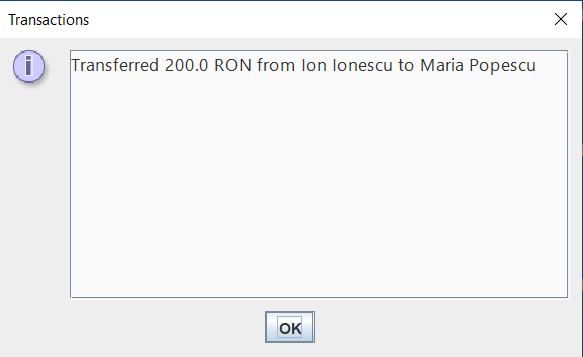

# Banking-Application

Banking application with a built GUI in Java.

The application also features unit tests created for each individual java class.

## Features
- Login System
- Ability to view the bank's clients
- Ability to view transactions that have occured in the session (transaction log)
- Ability to initiate money transfers between 2 clients using different currencies

## Example screenshots:

Login Page

Main Menu

Client List

Transaction Menu

Transaction Log

